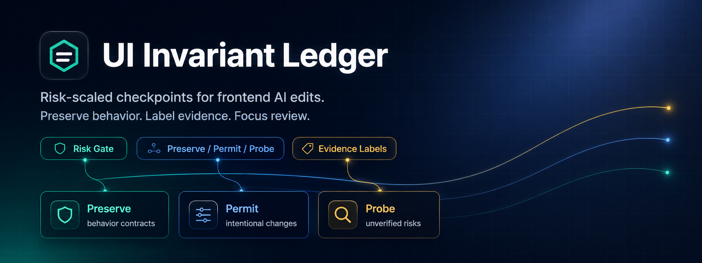
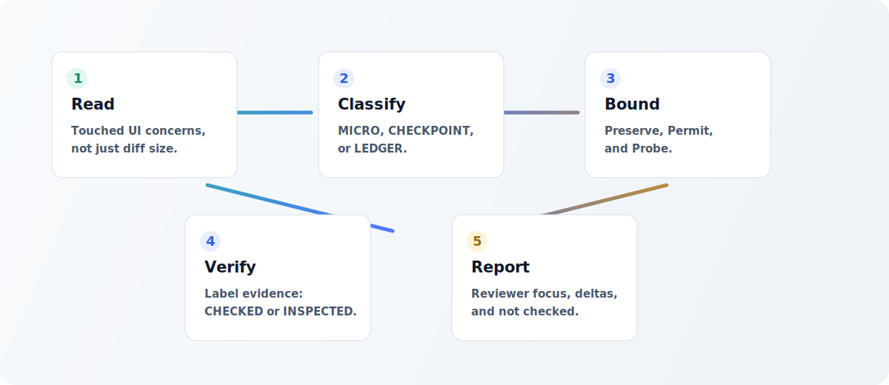

<p align="center">
  
</p>

<h1 align="center">UI Invariant Ledger</h1>

<p align="center">
  <strong>Risk-scaled checkpoints for preserving observable frontend behavior during AI edits.</strong>
</p>

<p align="center">
  <a href="https://github.com/Manuel-Mezzanotte/ui-invariant-ledger/actions/workflows/ci.yml"></a>
  <a href="https://github.com/Manuel-Mezzanotte/ui-invariant-ledger/releases/tag/v0.1.4"></a>
  <a href="LICENSE"></a>
  
</p>

<p align="center">
  <a href="#install">Install</a>
  · <a href="#why">Why</a>
  · <a href="#how-it-works">How It Works</a>
  · <a href="#modes">Modes</a>
  · <a href="#examples">Examples</a>
  · <a href="#limits">Limits</a>
</p>

## What It Is

UI Invariant Ledger is a markdown-first Agent Skill for AI coding agents. It makes the agent pause before and after frontend edits, classify risk, name the behavior that must stay intact, and report exactly what was checked versus merely inspected.

It is built for existing UI code where a small visual edit can accidentally change behavior: forms, modals, tables, menus, loading states, error states, accessibility behavior, responsive guards, and shared design-system primitives.

Current release: `v0.1.4`.

## Install

Install the pinned public release for Codex:

```bash
gh skill install Manuel-Mezzanotte/ui-invariant-ledger ui-invariant-ledger@v0.1.4 --agent codex --scope user
```

Other supported agents:

```bash
gh skill install Manuel-Mezzanotte/ui-invariant-ledger ui-invariant-ledger@v0.1.4 --agent claude-code --scope user
gh skill install Manuel-Mezzanotte/ui-invariant-ledger ui-invariant-ledger@v0.1.4 --agent opencode --scope user
```

Restart the target agent after installing. More install paths are documented in [docs/install.md](docs/install.md).

## Use

Invoke the skill explicitly when asking an agent to edit an existing frontend surface:

```text
Use $ui-invariant-ledger while cleaning up this SettingsModal.
```

Good prompts name the surface and the intended change:

```text
Use $ui-invariant-ledger while simplifying the invoice table toolbar.
Keep sorting, filters, empty state, pagination, and row actions intact.
```

## Why

AI agents can make UI changes that look correct on the happy path while silently breaking existing behavior:

- a modal still opens, but Escape or focus return stops working;
- a form still submits, but validation or disabled states changed;
- a table still renders, but sorting, filters, pagination, or row actions drifted;
- a loading path still exists, but an inline API error no longer appears;
- a responsive layout looks fine on desktop, but mobile overflow returns;
- a design-system primitive still compiles, but its public contract changed.

UI Invariant Ledger does not promise zero regressions. It makes risk, evidence, assumptions, and reviewer focus visible.

## Core Rule

If behavior can change, the task is never `MICRO`.

Risk is determined by touched concerns, not by diff size. A one-line change can be risky when it touches state, handlers, validation, accessibility, data mapping, or public component contracts.

## How It Works

<p align="center">
  
</p>

The skill asks the agent to:

- read the affected UI surface before editing;
- classify risk with the Risk Gate;
- separate what must be preserved from what may change;
- name specific probes for fragile behavior;
- re-check risk after the diff;
- label evidence honestly as `CHECKED`, `INSPECTED`, `ASSUMED`, or `STALE`;
- leave the reviewer with the few things that matter most.

## Modes

| Mode | Use For | Agent Output |
|---|---|---|
| `MICRO` | Tiny edits that cannot affect observable behavior | Under 80-token micro-check |
| `CHECKPOINT` | Local UI edits where side effects are plausible | Compact `Preserve / Permit / Probe` |
| `LEDGER` | Stateful, data-driven, accessible, public-contract, or multi-surface changes | Full ledger with evidence, delta, and reviewer focus |

### MICRO Preview

```text
Micro-check: copy-only label change. No handlers, state, data flow,
validation, focus, responsive rules, or public component contract touched.
Risk remains MICRO after diff.
```

### CHECKPOINT Preview

```text
UI Invariant Checkpoint

Mode: CHECKPOINT
Preserve: existing open/close behavior, disabled state, error copy.
Permit: spacing, grouping, non-semantic class names.
Probe: mobile overflow at 375px and keyboard tab order.
Evidence: INSPECTED component state paths, CHECKED lint.
```

### LEDGER Preview

```text
# UI Invariant Ledger

Mode: LEDGER
Risk drivers: form validation, submit state, modal focus, API error mapping.
Preserve: field validation, disabled submit, Escape close, focus return.
Changed: layout grouping and helper copy.
Evidence: CHECKED submit path and lint, INSPECTED error mapping.
Reviewer focus: mobile keyboard flow and API error branch remain unverified.
```

## Evidence

The skill uses precise evidence labels:

| Label | Meaning |
|---|---|
| `CHECKED` | Verified with a command, test, browser path, viewport, keyboard path, or concrete runtime check |
| `INSPECTED` | Read in code or diff, without independent behavior verification |
| `ASSUMED` | Inferred from surrounding patterns |
| `STALE` | Previous evidence not reconfirmed in the current task |

The agent should not claim "fully verified", "safe", "no regressions", or "everything works".

## Examples

| Scenario | Mode | Example |
|---|---|---|
| Copy or spacing-only edit | `MICRO` | [MICRO spacing-only change](examples/level-0-micro-change.md) |
| Local layout cleanup | `CHECKPOINT` | [CHECKPOINT local layout cleanup](examples/level-1-checkpoint-change.md) |
| Mobile navigation refinement | `CHECKPOINT` | [CHECKPOINT mobile navigation responsive change](examples/level-1-navigation-responsive-change.md) |
| Modal form cleanup | `LEDGER` | [LEDGER modal form cleanup](examples/level-2-ledger-change.md) |
| Data table state refactor | `LEDGER` | [LEDGER table state change](examples/level-2-table-state-change.md) |

## Best Fit

Use UI Invariant Ledger for:

- forms and validation;
- modals, dialogs, drawers, popovers, and menus;
- tables, filters, sorting, pagination, and empty states;
- loading, error, pending, disabled, and success states;
- data fetching and API mapping;
- navigation and routing;
- accessibility behavior;
- responsive layout and overflow-sensitive surfaces;
- shared design-system primitives.

Do not use it as:

- a replacement for real tests or browser verification;
- a security scanner;
- a claim that no regressions exist;
- a reason to produce long ledgers for trivial copy-only edits.

## Repository Layout

```text
skills/ui-invariant-ledger/SKILL.md
skills/ui-invariant-ledger/references/risk-gate.md
skills/ui-invariant-ledger/assets/checkpoint-template.md
skills/ui-invariant-ledger/assets/ledger-template.md
assets/readme-banner.png
assets/readme-flow.svg
docs/
examples/
scripts/validate_skill.py
```

## Validate

Run local repository validation:

```bash
python3 scripts/validate_skill.py
```

Run GitHub CLI skill validation:

```bash
gh skill publish --dry-run
```

CI runs the local validation on every push to `main`.

## Docs

- [Install guide](docs/install.md)
- [Known limitations](docs/known-limitations.md)
- [Additional documented tests](docs/additional-tests.md)
- [Roadmap](docs/roadmap.md)
- [Contribution guide](CONTRIBUTING.md)
- [Changelog](CHANGELOG.md)

## Limits

The v0.1 line intentionally stays small. It does not include:

- persistent `.ui-invariants/surfaces/*.md` ledgers;
- detector rules;
- custom CLI;
- mandatory scripts inside the skill package;
- full ledger output for every tiny task.

More detail: [docs/known-limitations.md](docs/known-limitations.md).

## Roadmap

See [docs/roadmap.md](docs/roadmap.md). Future versions should be driven by real usage, repeated failure modes, and reviewer feedback rather than speculative automation.

## Contributing

Bug reports, examples, and focused improvements are welcome. Start with [CONTRIBUTING.md](CONTRIBUTING.md).

## License

MIT. See [LICENSE](LICENSE).
